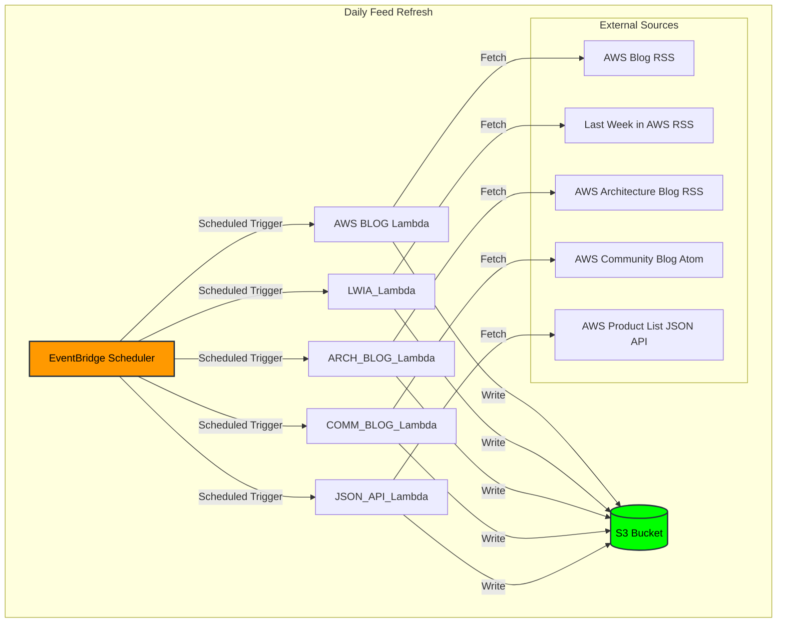
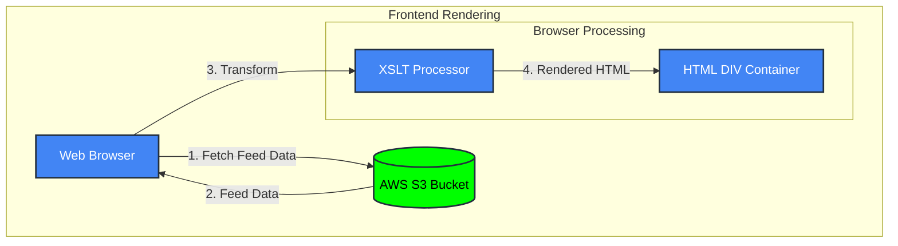

# Feed Processing Flow

```mermaid
flowchart TB
    subgraph "Daily Feed Refresh"
        EB[EventBridge Scheduler]
        AWS_BLOG_Lambda[AWS BLOG Lambda]
        S3[(S3 Bucket)]
        
        EB -->|"Scheduled Trigger"| AWS_BLOG_Lambda
        AWS_BLOG_Lambda-->|Fetch| AWS_BLOG
        AWS_BLOG_Lambda-->|Write| S3

        EB -->|"Scheduled Trigger"| LWIA_Lambda
        LWIA_Lambda-->|Fetch| LWIA
        LWIA_Lambda-->|Write| S3

        EB -->|"Scheduled Trigger"| ARCH_BLOG_Lambda
        ARCH_BLOG_Lambda-->|Fetch| ARCH_BLOG
        ARCH_BLOG_Lambda-->|Write| S3

        EB -->|"Scheduled Trigger"| COMM_BLOG_Lambda
        COMM_BLOG_Lambda-->|Fetch| COMM_BLOG
        COMM_BLOG_Lambda-->|Write| S3

        EB -->|"Scheduled Trigger"| JSON_API_Lambda
        JSON_API_Lambda-->|Fetch| JSON_API
        JSON_API_Lambda-->|Write| S3

        subgraph "External Sources"
            AWS_BLOG[AWS Blog RSS]
            LWIA[Last Week in AWS RSS]
            ARCH_BLOG[AWS Architecture Blog RSS]
            COMM_BLOG[AWS Community Blog Atom]
            JSON_API[AWS Product List JSON API]
        end
    end
    
    classDef s3aws fill:#00ff00,stroke:#232F3E,stroke-width:2px,color:black;
    classDef aws fill:#FF9900,stroke:#232F3E,stroke-width:2px,color:black;
    
    class EB,Lambda aws;
    class S3 s3aws;
    class AWS_BLOG,LWIA,ARCH_BLOG,COMM_BLOG,JSON_API external;
```

```mermaid
flowchart 
    subgraph "Frontend Rendering"
        Browser[Web Browser]
        
        subgraph "Browser Processing"
            XSLT[XSLT Processor]
            DIV[HTML DIV Container]
        end

        Browser -->|1. Fetch Feed Data| S3
        S3[(AWS S3 Bucket)] -->|2. Feed Data| Browser
        Browser -->|3. Transform| XSLT
        XSLT -->|4. Rendered HTML| DIV
    end
    
    classDef aws fill:#00ff00,stroke:#232F3E,stroke-width:2px,color:black;
    classDef browser fill:#4285F4,stroke:#232F3E,stroke-width:2px,color:white;
    
    class S3 aws;
    class Browser,XSLT,DIV browser;
```