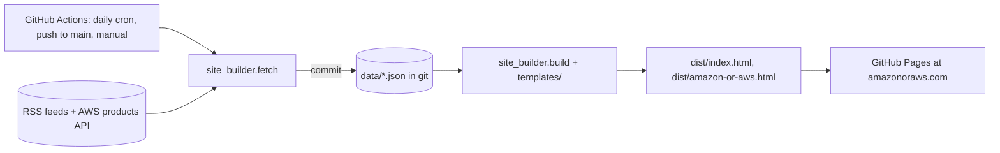

# Daily refresh

```mermaid
flowchart LR
    Cron[GitHub Actions: daily cron, push to main, manual] --> Fetch[site_builder.fetch]
    Sources[(RSS feeds + AWS products API)] --> Fetch
    Fetch -->|commit| Data[(data/*.json in git)]
    Data --> Build[site_builder.build + templates/]
    Build --> Dist[dist/index.html, dist/amazon-or-aws.html]
    Dist --> Pages[GitHub Pages at amazonoraws.com]
```
